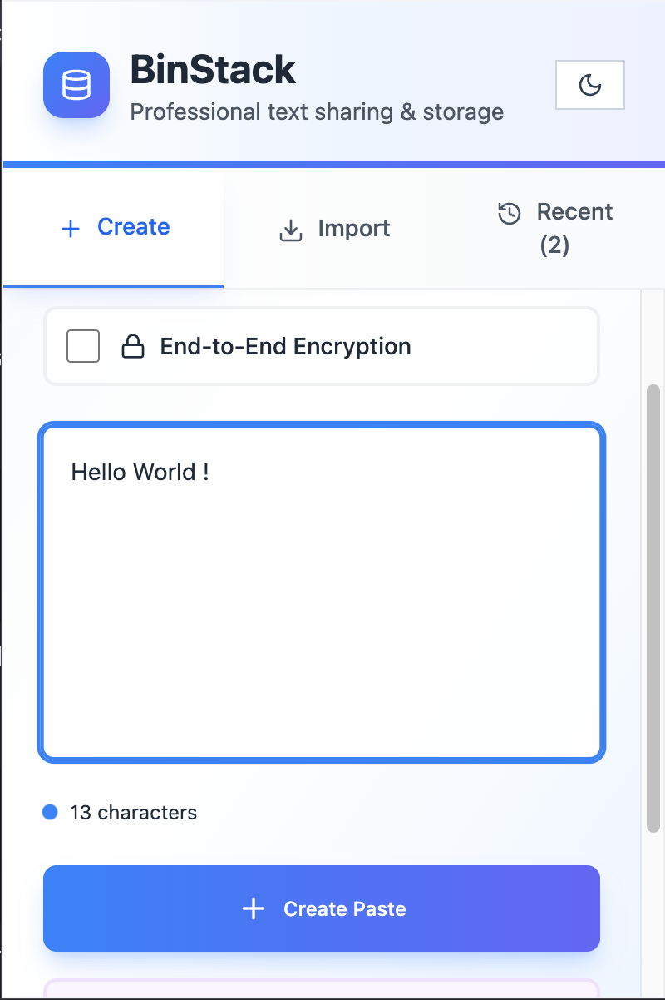
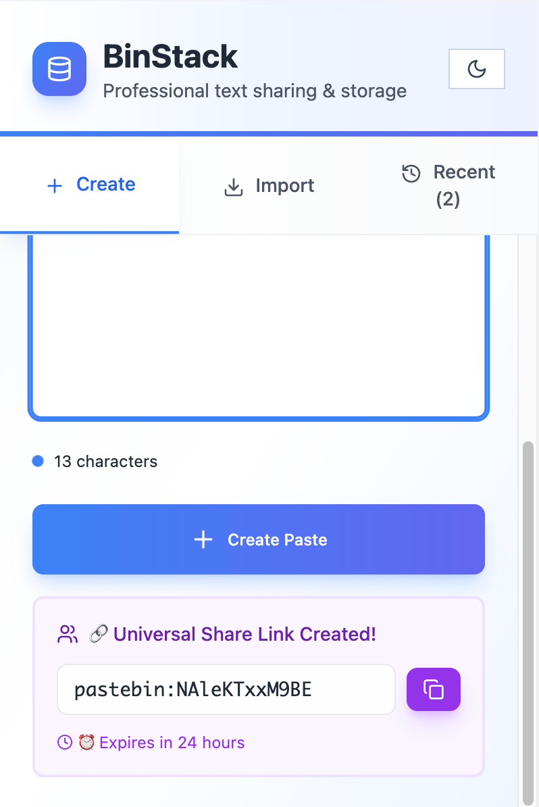
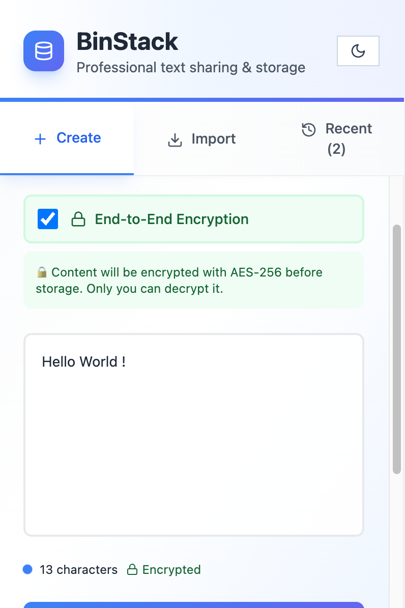
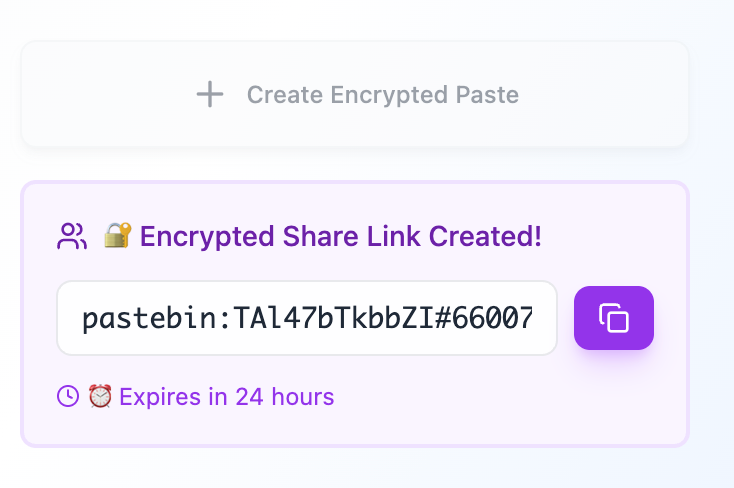
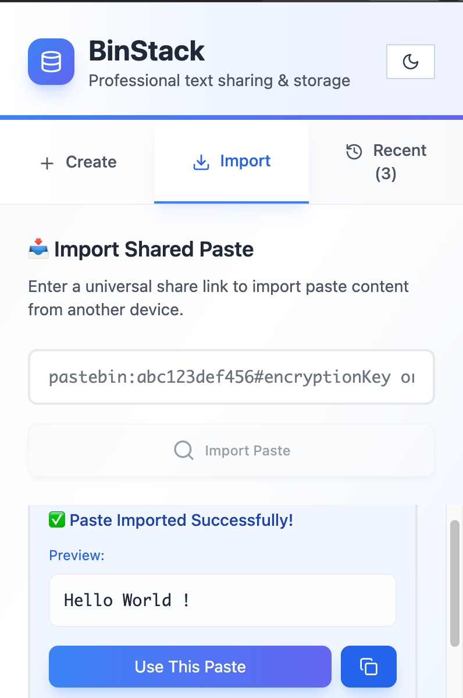
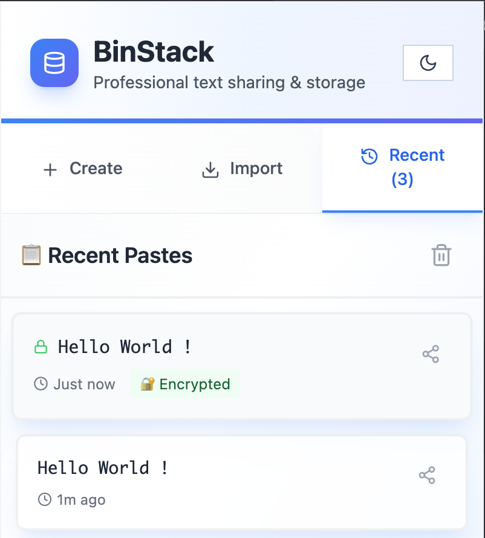
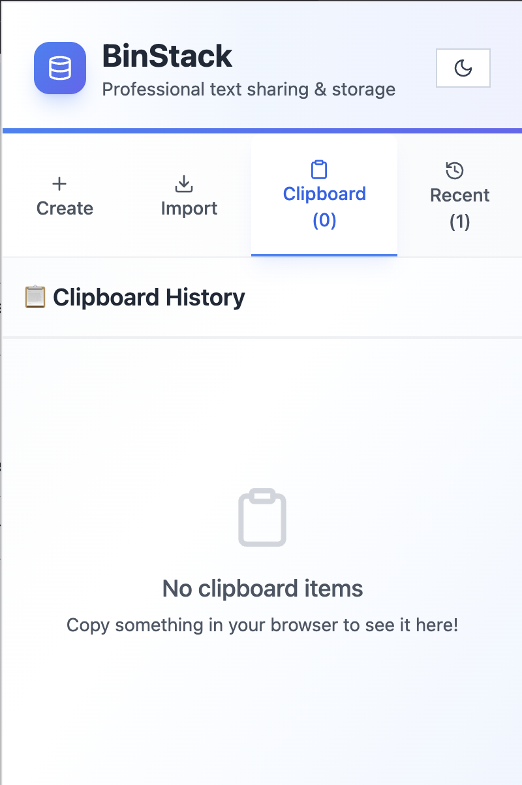

# BinStack — Professional Text Sharing & Storage Extension

<div align="center"> 
  <strong>A powerful Chrome extension for seamless text sharing and storage</strong><br/> 
  <em>Create • Share • Import • Encrypt</em> 
</div>

#

## Overview

BinStack is a professional Chrome extension that makes text sharing effortless. Create pastes, generate shareable links, and import content across devices with optional end-to-end encryption.

Perfect for developers, writers, and anyone who needs to quickly share text snippets between devices.

#

## Features

### Core Capabilities
- **Lightning-Fast** — Create and share pastes in seconds
- **Universal Share Links** — Generate temporary, cross-device paste URLs
- **Cross-Device Import** — Retrieve shared pastes instantly on any device
- **Smart History** — Quick access to your last 10 pastes
- **One-Click Clipboard** — Seamless native clipboard integration
- **Automatic Clipboard Tracking** — Automatically captures clipboard content and generates shareable links with one click

### User Experience
- **Dark/Light Mode** — Elegant theme switcher with system preference detection
- **Real-time Analytics** — Live character count and paste size monitoring (max 1MB)
- **Instant Operations** — Sub-second response times for all operations
- **Smooth Animations** — Beautiful UI with fluid transitions

### Security & Privacy
- **End-to-End Encryption** — Optional AES-256 encryption for your pastes
- **Temporary Links** — Auto-expiring after 24 hours (default)
- **Local-First Storage** — Recent pastes stored securely in your browser
- **Zero Tracking** — No analytics, no third-party data sharing
- **Secure Share Links** — Encryption keys embedded in share URLs (when encrypted)

#

## Screenshots

### Main Interface
<div align="center">
  
  
</div>

### End-to-End Encryption
<div align="center">
  
  
  <p><em>Optional AES-256 encryption with secure share links</em></p>
</div>

### Cross-Device Sharing
<div align="center">
  
  <p><em>Universal share links work across all devices</em></p>
</div>
<div align="center">
  
</div>

#

### Clipboard Tracking
<div align="center">
  
  <p><em>Automated Clipboard Pastes</em></p>
</div>

## Installation & Setup

### Quick Start (Pre-built Extension)

**Don't want to build? Download the ready-to-use extension:**

1. **Download the Build Folder**
   - Download from: [Google Drive - Build Folder](https://drive.google.com/drive/folders/1FTTCqWtqvn-DJybmyzdxNyR6P46kXUEU?usp=sharing)
   - Extract the `build` folder to your computer

2. **Load Extension in Browser**
   - Open Chrome or Brave browser
   - Navigate to `chrome://extensions` or `brave://extensions`
   - Enable **Developer Mode** (toggle in top-right corner)
   - Click **Load Unpacked**
   - Select the downloaded `build` folder

3. **Start Using BinStack!**
   - Click the BinStack icon in your browser toolbar
   - Start creating and sharing pastes!

---

### Build from Source

**Want to build it yourself or make changes?**

### Prerequisites

- Node.js 18.x or higher
- npm or yarn
- Git

### Installation Steps

1. **Clone the Repository**
```
git clone https://github.com/techyarnav/BinStack
cd BinStack
```

2. **Install Dependencies**
```
cd client
npm install
```

3. **Build the Extension**
```
npm run build
```

4. **Load Extension in Browser**
   - Open Chrome or Brave browser
   - Navigate to `chrome://extensions` or `brave://extensions`
   - Enable **Developer Mode** (toggle in top-right corner)
   - Click **Load Unpacked**
   - Select the `client/build/` directory from the cloned repository

5. **Start Using BinStack!**
   - Click the BinStack icon in your browser toolbar
   - Start creating and sharing pastes!

#

## How to Use

### Creating a Paste
1. Click the BinStack extension icon
2. Enter your text in the text area
3. (Optional) Enable **End-to-End Encryption** for secure pastes
4. Click **Create Paste**
5. Copy the generated share link

### Sharing Pastes
- Share links are automatically generated when you create a paste
- Links expire after 24 hours by default
- Encrypted pastes include the encryption key in the share URL

### Importing Pastes
1. Go to the **Import** tab
2. Paste the share link (format: `pastebin:abc123def456` or `pastebin:abc123def456#key` for encrypted)
3. Click **Import Paste**
4. Use the imported content or copy it to clipboard

### Clipboard History
- **Automatic Tracking** — The extension automatically tracks everything you copy in your browser
- **Clipboard Tab** — View all your clipboard items in the dedicated Clipboard tab
- **One-Click Sharing** — Click any clipboard item to instantly create a paste and generate a shareable link
- **Persistent Storage** — Clipboard history is saved and persists across browser sessions

### Recent Pastes
- View your last 10 pastes in the **Recent** tab
- Create new share links for old pastes
- Clear history anytime

#

## Security & Privacy

- **End-to-End Encryption** — AES-256 CBC encryption with client-side key management
- **Zero-Knowledge Architecture** — Servers never see plaintext content (when encrypted)
- **Temporary Links** — Auto-expiring after 24 hours
- **Secure Share Links** — Encryption keys embedded in share URLs
- **Browser-Local Keys** — Encryption keys stored only in your browser
- **HTTPS Transport** — All API calls encrypted in transit

#

## Live Demo & Links

**Chrome Web Store**: Coming Soon

#

## Contributing

We welcome contributions! Here's how you can help:

1. Fork the repository
2. Create your feature branch (`git checkout -b feature/amazing-feature`)
3. Commit your changes (`git commit -m 'Add some amazing feature'`)
4. Push to the branch (`git push origin feature/amazing-feature`)
5. Open a Pull Request

#

## License

This project is licensed under the MIT License - see the [LICENSE](LICENSE) file for details.

#

## Contact

For questions or support, please open an issue on GitHub.

---

<div align="center">

⭐️ Star this repository if you find it useful!

Built with ❤️ for seamless text sharing

</div>
